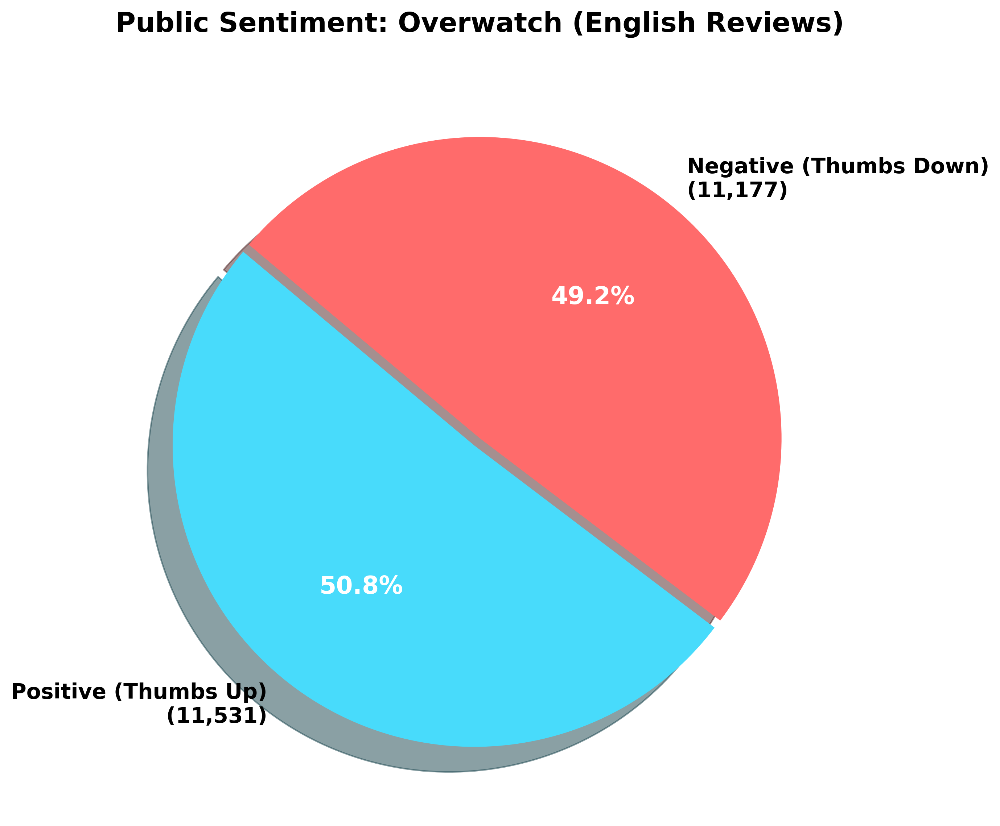
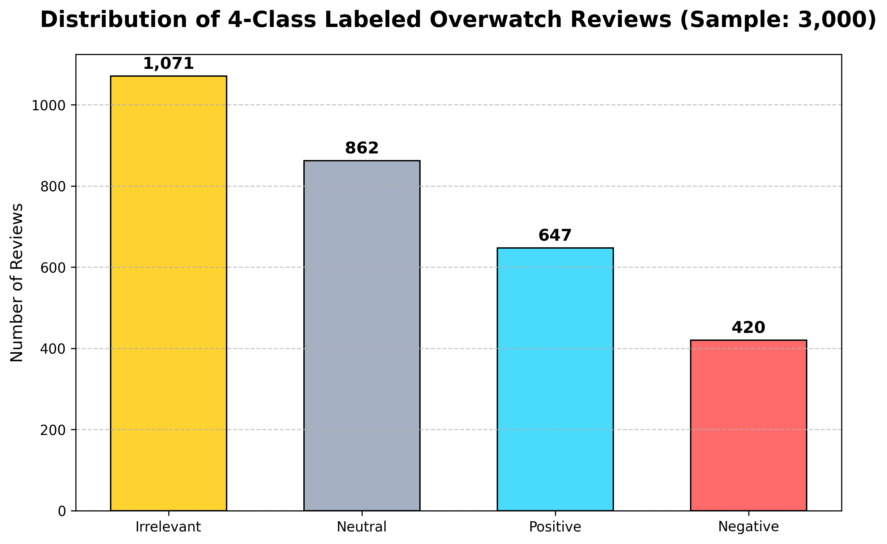

# MobileBERT를 활용한 대전형 슈팅 게임 리뷰 분석 프로젝트

---

## 1. 프로젝트 개요 
**[선정 배경 및 목적]**
평소 즐겨 플레이하던 '오버워치'의 유저 동향과 리뷰를 심층적으로 분석해 보고자 본 프로젝트를 기획하였습니다. 글로벌 게임 시장의 판도를 바꿨던 오버워치는,
후속작인 '오버워치 2'로 전환하는 과정에서 비즈니스 모델 변경(무료화 및 배틀패스 도입), 스토리(PvE) 모드 대규모 취소 등 다양한 변곡점을 맞이하며 유저 커뮤니티와 극심한 갈등을 겪어왔습니다.
이에 스팀(Steam) 플랫폼에 누적된 오버워치의 유저 리뷰 데이터를 직접 수집하여 긍정 및 부정을 분류하고 예측하며, 리뷰 텍스트 분석을 통해 악평(부정적인 리뷰)이 높은 근본적인 원인과 운영적 이슈를 분석해 보고자 합니다.

## 2. 데이터
### 2-1 데이터 수집
**직접 수집 (Steam Web API 기반 파이썬 크롤러 구축)**
* **수집처:** 스팀 리뷰 API (오버워치 2 App ID: 2357570)
* **데이터 항목:** 리뷰 고유 ID, 게임명, 리뷰 텍스트, 시스템 추천 여부(voted_up), 플레이 타임 등
* **총 건수:** API 커서(Cursor)를 활용하여 최신순 정렬 기준으로 영문(English) 원본 데이터 총 **35,260건** 수집 완료

### 2-2 탐색적 데이터 분석 (EDA)
스팀 리뷰 생태계 특유의 노이즈(ASCII 점자 그림, 무의미한 단답형 리뷰, 특수문자 도배 등)를 
전처리하여 최종적으로 **22,095건**의 유효한 분석 대상 데이터를 확보하였습니다.

| 구분 | 게임명 | 총 유효 리뷰 수 | 긍정 비율 (Recommended) | 부정 비율 (Not Recommended) |
|---|---|---|---|---|
| 1 | Overwatch 2 | 22,095건 | 52.0% | 48.0% |

**[분석 결과: 붕괴된 유저 신뢰와 호불호의 극단화]**
데이터 탐색 결과 긍정 50.8%, 부정 49.2%로 나타났습니다. 
라이브 서비스 게임에서 부정 평가가 절반(49%)에 육박한다는 것은 커뮤니티 민심이 사실상 '위기' 수준임을 나타내는 것과 같습니다.
전작에서 이어져 온 영웅 밸런스 문제뿐만 아니라, 과금 모델 변경 및 약속된 콘텐츠(PvE) 파기 등이 누적되어 기존 코어 유저층의 강한 반발을 사고 있음을 데이터가 정확히 짚어내고 있습니다.

## 3. 학습 데이터 구축
확보된 총 22,095건의 유효 데이터 중, 딥러닝 모델 학습을 위해 무작위로 **3,000건**의 샘플 데이터를 별도 추출하여 4가지로 분류했습니다.

### 3-1 데이터 라벨링 및 검증
단순한 이진 분류(추천/비추천)의 한계를 극복하고자, 텍스트 본문의 실제 뉘앙스를 적용하였습니다. 특히 "i love this game do i recommend it to other? NO!"와 같이 버튼과 텍스트의 감정이 충돌하는
모순된 리뷰를'Neutral(중립)'로 정밀하게 걸러내어 학습 데이터의 순도를 극대화하였습니다.

| 구분 (Class) | 데이터 라벨링 분류 기준 | 실제 스팀 리뷰 텍스트 샘플 (추출 결과) |
| :--- | :--- | :--- |
| **Positive (긍정)** | VADER 점수 > 0.15 이며 추천(Up)을 누른 텍스트 | "overwatch is suprisingly fun right now...", "JUNO <3 AND MERCY <3 I LOVE MY HEALERS!" |
| **Negative (부정)** | VADER 점수 < -0.15 이며 비추천(Down) 누른 텍스트 | "Ts is so ass", "I miss when this game had personality and wasnt corpo slop" |
| **Neutral (중립)** | 누른 버튼과 텍스트의 감정이 불일치하는 모순 리뷰 | "i love this game do i recommend it to other? NO!", "Bought this on disk on release day on 2016..." |
| **Irrelevant (관계없음)** | 4단어 미만의 무의미한 단답형이거나 스팸 텍스트 | "YES!", "gud" |

### 3-2 학습 데이터 세트 구성
4-Class 라벨링이 완료된 3,000건의 최종 데이터셋을 8:2 비율로 분할하여 텐서(Tensor) 구조의 학습 및 검증 데이터를 구성하였다.
* **학습 데이터(Train):** 2,400건
* **검증 데이터(Validation):** 600건

## 4. MobileBERT 모델 학습 (Fine-tuning)
* **학습 환경 설정:** `google/mobilebert-uncased` 모델을 활용하여 4-Class Sequence Classification을 수행하였습니다. (Epoch 4, Batch Size 8, Optimizer: Adam lr=2e-5, Linear Warmup Scheduler 적용)
* **학습 결과 도출:**
  * Epoch 1: 학습 오차 186795.5688, 학습 정확도 0.5832, 검증 정확도 0.5383
  * Epoch 2: 학습 오차 6.7621, 학습 정확도 0.5802, 검증 정확도 0.5367
  * Epoch 3: 학습 오차 2.6301, 학습 정확도 0.6678, 검증 정확도 0.6283
  * Epoch 4: 학습 오차 0.7839, 학습 정확도 0.7015, 검증 정확도 0.6150
* **결과 해석:** 초기 학습 오차가 급격히 감소하며 모델의 최적화 방향이 올바르게 설정되었음을 확인하였습니다. 비꼬기(Sarcasm)가 섞인 4가지 클래스의 거친 텍스트 데이터임에도 불구하고, 
* 단 4 Epoch 만에 검증 정확도가 53.8%에서 61.5%로 우상향하며 유의미한 자연어 분류 성능 향상을 달성하였습니다.

## 5. 문제제기에 대한 결과 (악평 게임에 대한 원인 분석)
단순 감성 분류를 넘어, TF-IDF(단어 빈도-역문서 빈도) 기법을 통해 부정 리뷰의 핵심 토픽 가중치를 추출하여 근본적인 원인을 도출하였습니다.
* **분석 결과:** `blizzard`, `worst`, `sucks` 등의 키워드가 부정 리뷰 최상위를 차지하였습니다. 이는 인게임 시스템이나 밸런스 문제보다는 운영사인 '블리자드' 자체에 대한 불신과 유저 기만(PvE 취소 등)에 대한 분노가 주된 원인임을 보여주고 있습니다.
* **결론:** 게임의 본질적인 플레이 경험보다, 게임사에 대한 불만과 불신이 민심 이탈에 더 크게 작용했다는 점이 본 분석의 가장 핵심적인 부분이라고 생각합니다. 라이브 서비스 게임에서는 단기적인 비즈니스 모델(BM)보다 '유저 커뮤니티와의 신뢰 유지'가 절대적인 영향을 미친다는 것을 느끼게 되었습니다.

## 6. 느낀점 및 개선방향
* **느낀점:** 초기 기획 단계에서는 발로란트 등 타 대전형 슈팅 게임과의 비교 분석을 기획했으나, 방대한 양의 리뷰 데이터를 제공하는 플랫폼의 부재 및 데이터 확보의 한계(예: 발로란트의 경우 2021년 과거 데이터만 존재)로 인해 '오버워치 단일 게임의 여론 심층 분석'으로 방향을 바꾸었습니다. 단일 게임에 집중함으로써,
모순된 리뷰(Neutral)를 분리하는 등 라벨링의 깊이를 더할 수 있게 되었습니다.
* **개선방향:** 텍스트 정제 과정에서 특수문자를 일괄 제거할 때 `don't`와 같은 축약어가 `don`과 `t`로 파편화되는 토큰화 한계가 발견되었다. 향후 NLTK 등 전문 자연어 처리 라이브러리의 정규화 도구를 보다 적극적으로 도입하여 데이터 전처리 품질을 올려보고자 합니다.
